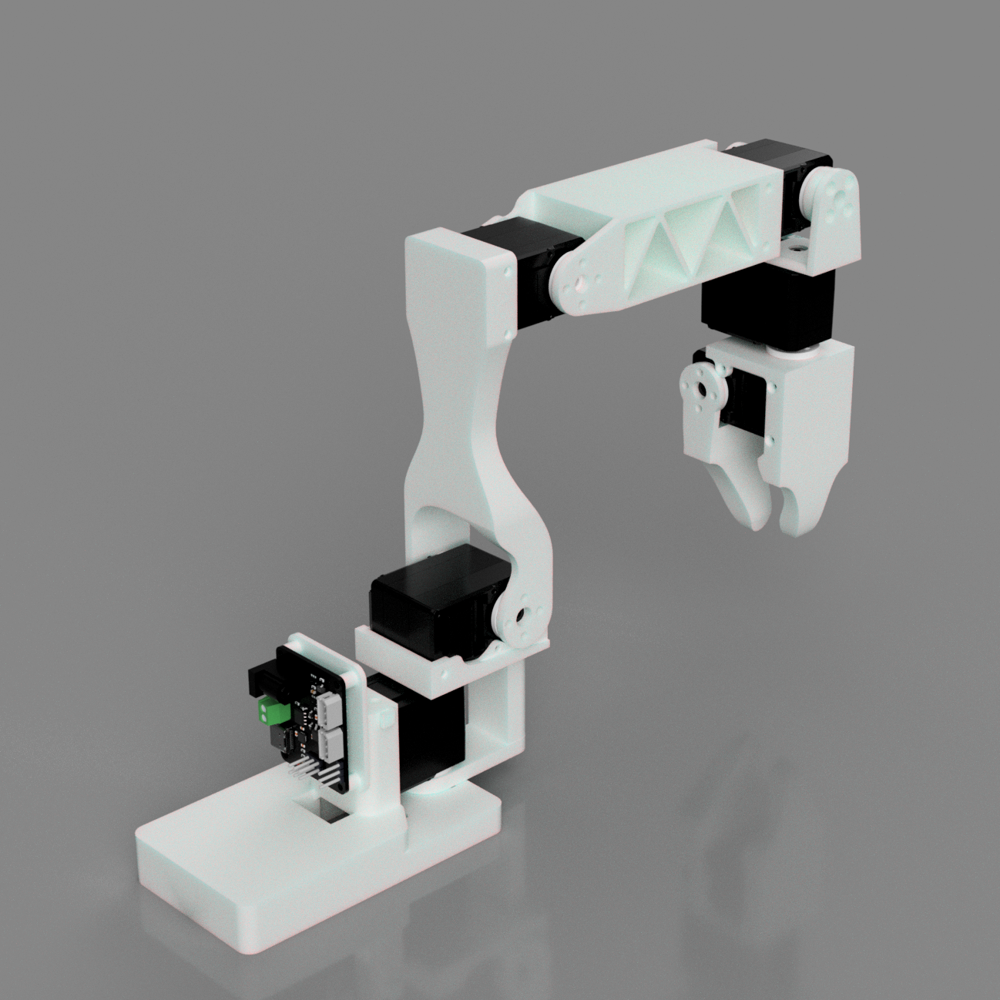
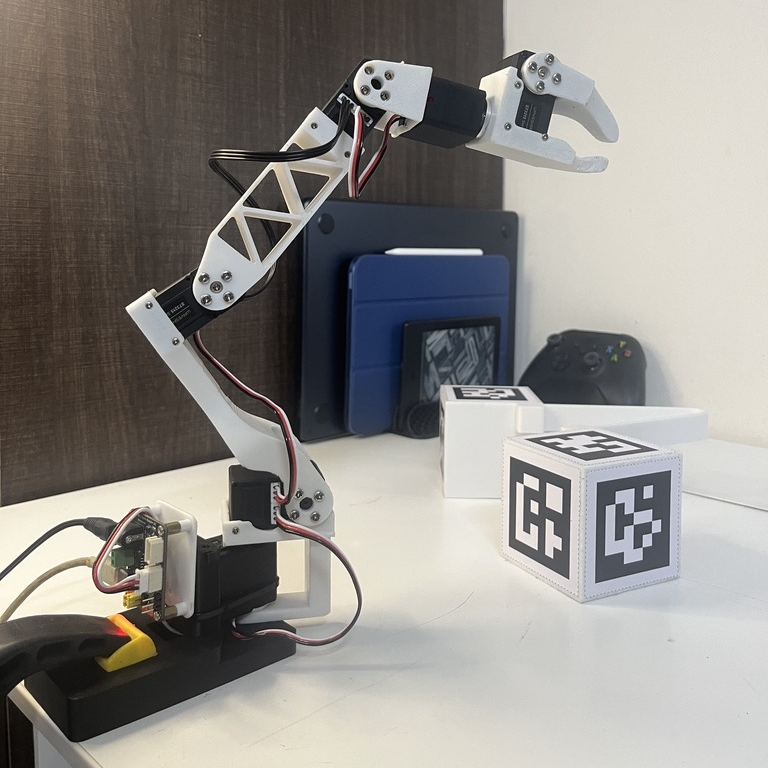

# _giraffe: a low-cost robotic manipulator_ 🦒

``` text
                                   __             ___  ___       
                            .-----|__.----.---.-.'  _.'  _.-----.
                            |  _  |  |   _|  _  |   _|   _|  -__|
                            |___  |__|__| |___._|__| |__| |_____|
                            |_____|

                               Why should fun be out of reach?
```

A [Koch v1.1](https://github.com/jess-moss/koch-v1-1) inspired even more cost-effective, ROS2-compatible, Open-Source robotic manipulator designed to lower the barriers to entry for Embodied AI and whatever else your robotic dreams may be.

Most significant changes that we have made to achive this outcome are:

- Used cost efficient Waveshare servos instead of Dynamixel servos.
- Made changes to the base to shift the Radial Load on the base motor to the structure itself and fixed the servo driver closer to the base.
- <sub> Added Teleop Tong instead of Leader Arm.<sub>

---

## Assembly Instructions



### Sourcing Parts

Order the off the shelf parts for the arm using the links below.

| Part | Amount | Unit Cost | Total Cost | Buying Link |
| ---- | ------ | --------- | ---------- | ----------- |
| WaveShare ST3215 30Kg   | 6      | ₹1,949.00  | ₹11,694.00  | [Robu.in](https://robu.in/product/waveshare-30kg-serial-bus-servo/) |
| Waveshare Serial Bus Servo Driver Board          | 1      | ₹499.00    | ₹499.00     | [Robu.in](https://robu.in/product/waveshare-serial-bus-servo-driver-board-integrates-servo-power-supply-and-control-circuit-applicable-for-st-sc-series-serial-bus-servos/) |
| 12V 20A Power Supply               | 1      | ₹895.00    | ₹895.00     | [Sharvi Electronics](https://sharvielectronics.com/product/12v-20a-smps-240w-dc-metal-power-supply-non-water-proof/) |
| Barrel Jack            | 1      | ₹48.00     | ₹48.00      | [Robu.in](https://robu.in/product/90-degree-dc-5-52-1-wire/?gad_source=1&gclid=CjwKCAiA6t-6BhA3EiwAltRFGNNYxj1vEJeKhvtbnl8pWDtIrHhBP-588FWfVt-4cpQKjADzB8ReXRoC6OgQAvD_BwE) |
| Power cord             | 1      | ₹95.00     | ₹95.00      | [Sharvi Electronics](https://sharvielectronics.com/product/3pin-250vac-6a-power-cord-with-open-ended-cable-1-8-meter/) |
| USB-C cable            | 1      | ₹60.85     | ₹60.85      | [Sharvi Electronics](https://sharvielectronics.com/product/usb-2-0-a-type-male-usb-to-c-type-male-usb-cable-white-1-meter/) |
| Table clamp            | 1      | ₹349.00    | ₹349.00     | [Amazon.in](https://www.amazon.in/Homdum%C2%AE-Heavy-Clamp-Clamping-Pieces/dp/B081JYTMMG/ref=sr_1_32?crid=QS1GUQTHCIA4&dib=eyJ2IjoiMSJ9.Y6mMQKO3pYbkI5fuZZzRhmnaPEBkYUkfOdl_Uj2xmTahB1NzMLIqDi11tQEZsaF1AxDV1ndeI3h8bgnuV-SC9BiiFRj-ue_9jcyv4AsPg8YFZYe88-nm9JJ-UuEi7mFuk_8BUDldMJHKtgjKadYxvK3mqiltsGnM-1lkpJP6EmLklcT_r5J6PWWOvkh3a61a820TLtVkROcI2NKFt01PPFNt-EFB345zzs7uvYM434AFK9pRAve6-BtV_NEjXxhXwu4jVUDtNKTafPm8gwMow4hQDV2vYJ3KfqIFEPE8McGscfs-zgWCnpzyl6Dw0D1JuSiDTOfO9F1zKRaEgtLh-O48MckMmsgBaoCpQPOQqy0NKi6T0F4Wchb-x0TGvVZlh8rBH70Wz2G03owy2XS0XfroLHMvSb0RIvstaE2XQ8ID1pp8pUB0JZzPzPM_asOy.AOdTW8GzBEwdDFN3hAbqILHzc8RUdrFOTYUdAGj1WnU&dib_tag=se&keywords=table%2Bclamp&qid=1734041544&refinements=p_72%3A1318476031&rnid=1318475031&sprefix=table%2Bclamp%2Caps%2C248&sr=8-32&th=1) |
| Total |  |  | ₹14,490 | |


### Printing the Parts

A variety of 3D printers can be used to print the necessary parts for the arm. Follow these steps for optimal printing results.

**1. Select a Printer**
When choosing a printer, keep the following recommended specifications in mind. While other printers may work, these spececifications are a good starting point:

- **Layer Height:** Minimum 0.2mm  
- **Material:** PLA+, ABS, PETG, or other durable plastics  
- **Nozzle Diameter:** Maximum 0.4mm  
- **Infill Density:** Approximately 30%  
- **Suggested Printers:** Prusa Mini+, Bambu P1, Ender3, and similar models

**2. Prepare the Printer**

- **Materials Needed:**
   - Standard Glue Stick  
   - Putty Knife  

- **Setup and Printing Process:**
   1. Calibrate the printer and level the print bed following your printer’s specific instructions.
   2. Clean the print bed, removing any dust or grease. If you use water or other cleaning agents, ensure the bed is fully dry.
   3. Apply a thin, even layer of glue to the print area. Avoid uneven application or clumps.
   4. Load the printer filament according to the printer's guidelines.
   5. Adjust the printer settings to match the recommended specifications listed above.
   6. Verify the file format, select files from the hardware folder, and begin printing.


**3. Print the Parts** Print one of each part found in `CAD/STL`
   - List of Parts

**4. Take Down**
- After the print is done, use the putty knife to scrape the the parts off the print bed.
- Remove any support material from parts.

---

## Assembling the Parts

Construct the arms using this Assembly [Video](https://www.youtube.com/watch?v=8nQIg9BwwTk&=8m20s) (Note: Follow the assembly instructions provided for Follower Arm starting at 08:20 of the video). After you assemble the arms from the video, power the arm using the 12V power supply. In addition, plug the arm into your computer using a USB-C cable.

The Arm after assembly should look like this:
- 

---

## Setup Instructions

> NOTE: Configurator and the rest of the high-level software stack is presently only compatible with Python.  

### Clone the [giraffe](https://github.com/carpit680/giraffe) repository

``` bash
git clone https://github.com/carpit680/giraffe.git -b moveit
cd giraffe
```

### Install dependencies

```bash
pip install -r requirements.txt
pip install .
```

### Setup permissions

```bash
sudo usermod -a -G dialout $USER
sudo newgrp dialout
```